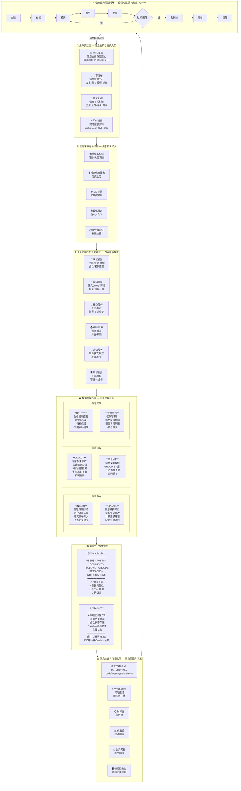

```mermaid
flowchart TD
    %% 样式定义
    classDef userLayer fill:#E8F5E9,stroke:#2E7D32,stroke-width:2px,color:#1B5E20
    classDef collectLayer fill:#E3F2FD,stroke:#1565C0,stroke-width:2px,color:#0D47A1
    classDef serviceLayer fill:#FFF3E0,stroke:#E65100,stroke-width:2px,color:#BF360C
    classDef dbLayer fill:#FCE4EC,stroke:#AD1457,stroke-width:2px,color:#880E4F
    classDef storageLayer fill:#EDE7F6,stroke:#4527A0,stroke-width:2px,color:#311B92
    classDef outputLayer fill:#E0F7FA,stroke:#00695C,stroke-width:2px,color:#004D40
    classDef lifecycleLayer fill:#EFEBE9,stroke:#4E342E,stroke-width:2px,color:#3E2723

    %% ===== 用户交互层 =====
    subgraph USER["👤 用户交互层 — 信息生产与消费入口"]
        direction LR
        U1["📝 注册/登录<br/>信息主体身份建立<br/>邮箱验证·密码加密·OTP"]
        U2["📄 内容发布<br/>信息资源生产<br/>文本·图片·视频·标签"]
        U3["💬 社交互动<br/>信息关系构建<br/>关注·点赞·评论·群组"]
        U4["⚡ 即时通信<br/>实时信息流转<br/>WebSocket·频道·状态"]
    end
    class USER userLayer

    %% ===== 信息采集与验证层 =====
    subgraph COLLECT["🔍 信息采集与验证层 — 信息质量把关"]
        direction LR
        C1["表单格式校验<br/>类型/长度/范围"]
        C2["多模态信息接收<br/>流式上传"]
        C3["MIME检测<br/>元数据提取"]
        C4["参数化绑定<br/>防SQL注入"]
        C5["JWT令牌验证<br/>权限校验"]
    end
    class COLLECT collectLayer

    %% ===== 业务逻辑层 =====
    subgraph SERVICE["⚙️ 业务逻辑与信息处理层 — 六大服务模块"]
        direction LR
        S1["🔐 认证服务<br/>注册·登录·令牌<br/>会话·密码重置"]
        S2["📰 内容服务<br/>帖文CRUD·评论<br/>标引·热度计算"]
        S3["👥 社交服务<br/>关注·屏蔽<br/>推荐·关系查询"]
        S4["🏠 群组服务<br/>创建·成员<br/>角色·权限"]
        S5["🔔 通知服务<br/>事件触发·状态<br/>批量·恢复"]
        S6["🛡️ 审核服务<br/>合规·举报<br/>管控·AI分析"]
    end
    class SERVICE serviceLayer

    %% ===== 数据库操作层 =====
    subgraph DB["🗃️ 数据库操作层 — 信息管理核心"]
        direction LR
        subgraph DB_WRITE["信息写入"]
            D1["**INSERT**<br/>信息资源创建<br/>·用户注册入库<br/>·帖文原子写入<br/>·关系记录建立"]
            D4["**UPDATE**<br/>信息维护修正<br/>·资料定向修改<br/>·计数原子递增<br/>·状态批量流转"]
        end
        subgraph DB_READ["信息读取"]
            D2["**SELECT**<br/>信息检索获取<br/>·主键精确定位<br/>·分页列表检索<br/>·多表JOIN关联<br/>·模糊搜索"]
            D5["**聚合分析**<br/>信息深度挖掘<br/>·GROUP BY统计<br/>·用户画像生成<br/>·趋势分析"]
        end
        subgraph DB_CTRL["信息管控"]
            D3["**DELETE**<br/>生命周期控制<br/>·软删除标记<br/>·归档保留<br/>·过期自动清理"]
            D6["**安全管控**<br/>权限与审计<br/>·角色权限控制<br/>·视图字段屏蔽<br/>·备份恢复"]
        end
    end
    class DB dbLayer

    %% ===== 持久化存储层 =====
    subgraph STORAGE["💾 数据持久化与缓存层"]
        direction LR
        ST1["🗄️ **Oracle 19c**<br/>━━━━━━━━━━━━<br/>USERS · POSTS · COMMENTS<br/>FOLLOWS · GROUPS<br/>SESSIONS · NOTIFICATIONS<br/>━━━━━━━━━━━━<br/>✓ ACID事务<br/>✓ 外键完整性<br/>✓ B-Tree索引<br/>✓ 行级锁"]
        ST2["⚡ **Redis 7**<br/>━━━━━━━━━━━━<br/>· API响应缓存 TTL<br/>· 查询结果缓存<br/>· 会话状态存储<br/>· Pub/Sub消息总线<br/>· 在线状态<br/>━━━━━━━━━━━━<br/>命中→返回 &lt;5ms<br/>未命中→查Oracle→回填"]
    end
    class STORAGE storageLayer

    %% ===== 信息输出层 =====
    subgraph OUTPUT["📊 信息输出与可视化层 — 信息呈现与决策"]
        direction LR
        O1["🌐 RESTful API<br/>统一JSON响应<br/>code/message/data/meta"]
        O2["⚡ WebSocket<br/>实时推送<br/>跨实例广播"]
        O3["📋 时间线<br/>信息流"]
        O4["📊 仪表盘<br/>统计图表"]
        O5["🔗 关系网络<br/>社交图谱"]
        O6["🖥️ 管理控制台<br/>审核态势感知"]
    end
    class OUTPUT outputLayer

    %% ===== 信息生命周期 =====
    subgraph LIFECYCLE["♻️ 信息生命周期闭环 — 全程可追溯·可恢复·可审计"]
        direction LR
        L1["创建"] --> L2["存储"] --> L3["检索"] --> L4["利用"] --> L5["更新"]
        L5 --> L6{"过期/删除?"}
        L6 -->|是| L7["软删除"] --> L8["归档"] --> L9["清理"]
        L6 -->|否| L3
    end
    class LIFECYCLE lifecycleLayer

    %% ===== 连接关系 =====
    USER --> COLLECT
    COLLECT --> SERVICE
    SERVICE --> DB
    DB --> STORAGE
    STORAGE --> OUTPUT
    OUTPUT --> LIFECYCLE
    LIFECYCLE -->|"信息持续流转"| USER
```
